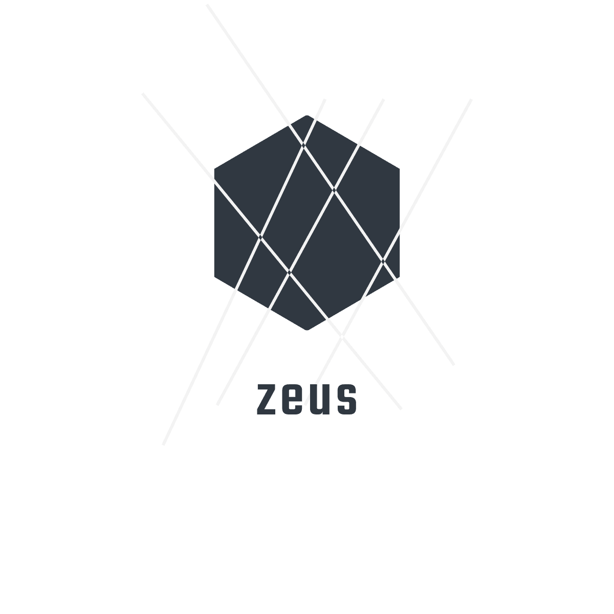

<h1 align="center">Welcome to Zeus</h1>
<!-- </a> -->

    

  </a> 
  
  
  
   
  

> Zeus is a lighting fast cryptocurrency trading application

  

  

## Table Of Contents

## Table of Contents

-   [Introduction](#introduction)
-   [Features](#features)
-   [Contributors](#contributors)
-   [Build Process](#build-process)
-   [Backers](#backers-)
-   [Sponsors](#sponsors-)

## Contributors

Contributions are welcome! Please see our [Contributing Guide](https://imthaghost/zeus)for more details.

<table>
  <tr>
    <td align="center"><a href="https://github.com/imthaghost"> <b>Gary Frederick</b></a> </td>
    <td align="center"><a href="https://github.com/SamuelFolledo"> <b>Samuel P. Folledo</b></a> </td>
    <td align="center"><a href="https://github.com/tylerholland12"> <b>Tyler Holland</b></a> </td>
     <td align="center"><a href="https://github.com/Andre-Williams22"> <b>Andre Williams</b></a> </td>
    </tr>  
</table>

## 📝 License

In short, when you submit code changes, your submissions are understood to be under the same [MIT License](http://choosealicense.com/licenses/mit/) that covers the project. Feel free to contact the maintainers if that's a concern.

By contributing, you agree that your contributions will be licensed under its MIT License.
